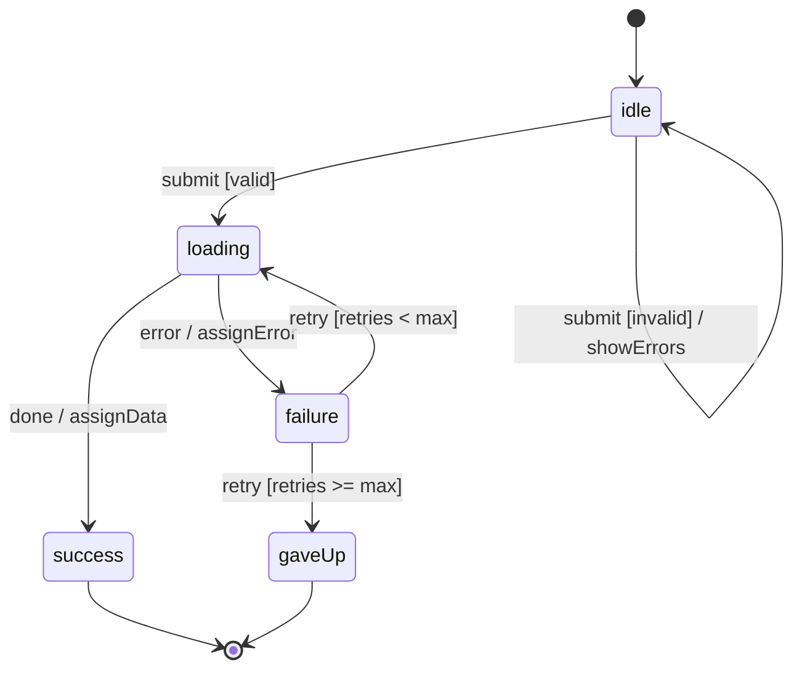

# State Machine Design Skill

This skill guides you through the complete process of designing a system using the
state machine / statechart pattern — from requirements capture to a production-ready
machine definition with implementation recommendations.

## When to load additional references

- **New to state machines / fundamentals needed**: read `references/theory.md` — formal
  definitions, variants (Moore/Mealy/HSM), UML notation, SCXML, core theorems, and patterns.
- **Implementation details** (XState v5, Redux, Python, PostgreSQL/Redis persistence,
  Temporal, AWS Step Functions, SSE/WebSocket sync, testing): read
  `references/implementation/INDEX.md` first — it has a selection guide. Then load only
  the specific file(s) that match the target stack. Never load the whole folder.

---

## Design Process

### Phase 1 — Requirements Capture

Before drawing any states, extract from the user (or infer from context):

1. **Domain**: What real-world entity or process are we modelling? (a UI component, a backend
   workflow, a protocol, a device, a user session?)
2. **Actors**: Who/what triggers events? (user, timer, server, another machine)
3. **Events**: What can happen? List all external signals and internal completions.
4. **Invariants**: What must _never_ be true simultaneously? (logged-in AND unauthenticated,
   loading AND has error)
5. **Success / terminal conditions**: When is the machine "done"?
6. **Error paths**: For every operation that can fail, how should failure be handled?
7. **Persistence tier**: Does the machine need to survive restarts? (see Phase 4 — Source of Truth)
8. **Delivery semantics**: Can any event arrive more than once? (user double-click, webhook retry,
   message-queue redelivery?) → mark those transitions as requiring idempotency guards.
9. **External dependencies**: Does any state wait on a network call, worker, or hardware signal
   that could silently disappear? → those states require timeout / heartbeat exits (see Phase 3a).

> Tip: Ask the user — _"What are the things that can happen to this system, and what do they
> cause?"_ This naturally elicits events. Then ask _"What does the system look like right now?"_
> to elicit states. Finally ask _"What external systems does this touch, and what happens if they
> go dark?"_ — this forces timeout and idempotency decisions up front.

---

### Phase 2 — State Enumeration

Apply the **"states-first"** technique:

1. List all the **distinct conditions** the system can be in (states ≠ data; states are modes
   of behaviour).
2. Challenge every proposed state: _"Does the system respond differently to any event in this
   state vs. another?"_ If not — merge them.
3. Identify the **initial state** (there is always exactly one).
4. Identify **terminal states** (zero or more; states from which no outgoing transitions exist).
5. Check for **impossible state combinations** and document them as invariants.

**Red flags during enumeration:**

- More than ~7–10 flat states → consider hierarchical decomposition.
- States named after data values (`hasError: true`) → these are context, not states.
- States that differ only by which step in a sequence → likely a compound state with sub-states.

---

### Phase 3 — Transition Mapping

For each state, enumerate:

```
(source_state) + event [guard?] / action? → (target_state)
```

Build a **transition table** (the δ function):

| Source State | Event   | Guard          | Action         | Target State |
| ------------ | ------- | -------------- | -------------- | ------------ |
| idle         | submit  | form valid     | —              | loading      |
| idle         | submit  | form invalid   | showErrors     | idle         |
| loading      | success | —              | assignData     | success      |
| loading      | error   | —              | assignError    | failure      |
| failure      | retry   | retries < max  | incrementRetry | loading      |
| failure      | retry   | retries >= max | —              | gaveUp       |

**Rules:**

- Every `(state, event)` pair must have an explicit outcome (handled, deferred, or forbidden).
- When multiple transitions share the same `(state, event)`, they must have **mutually exclusive guards**.
- Self-transitions (same source and target) are valid — use for actions that don't change mode.

**Idempotency rule — mandatory for at-least-once delivery:**
For any event flagged in Phase 1 as potentially duplicated, explicitly define what the machine
does when that event arrives in the state it would have already transitioned _to_. Options:

| Strategy                       | Implementation                                                                    |
| ------------------------------ | --------------------------------------------------------------------------------- |
| **Ignore**                     | No transition defined for that `(state, event)` — event is silently dropped.      |
| **Guard on `requestId`**       | Transition fires only if `event.requestId !== context.lastRequestId`.             |
| **Idempotency key in context** | Store a nonce on first execution; subsequent arrivals match and no-op.            |
| **Explicit dedup state**       | Machine enters a short-lived `deduplicating` state that checks an external store. |

Example — preventing double-charge on SUBMIT:

```
submitting + SUBMIT → [guard: already in submitting] → (ignored / self-transition, no action)
```

### Phase 3a — Timeout & Heartbeat Requirements

**Every state that waits on an external signal is a potential Black Hole.**

For each async / "waiting" state identified in Phase 1 item 9, add mandatory exits:

```
(waiting_state) + TIMEOUT / assignTimeoutError → failure
(waiting_state) + HEARTBEAT_MISSED → reconnecting   ← for long-running connections
```

Timeout design decisions to document:

| Decision               | Options                                                                          |
| ---------------------- | -------------------------------------------------------------------------------- |
| **Duration**           | Fixed (e.g., 30 s), exponential backoff, configurable via context                |
| **Scope**              | Per-attempt vs. total deadline (use both for critical paths)                     |
| **Action on timeout**  | Retry → failure, or immediately terminal                                         |
| **Who owns the timer** | The machine itself (`after` / `delay`), a parent actor, or an external scheduler |

XState pattern for built-in timeout:

```typescript
loading: {
  invoke: { src: 'fetchData', onDone: ..., onError: ... },
  after: {
    10000: { target: 'failure', actions: assign({ error: () => new Error('Timeout') }) }
  }
}
```

Backend / long-running pattern (heartbeat):

```
connected:
  on: { HEARTBEAT: { actions: 'resetWatchdog' } }   // resets a server-side timer
  after: { 30000: { target: 'reconnecting' } }       // fires if no heartbeat arrives
```

---

### Phase 4 — Context Design & Persistence Mapping

#### 4a — Context Design

Identify what data the machine must carry:

- **What values do guards reference?** → must be in context.
- **What values do actions produce?** → must be in context.
- **What is display-only data?** → may live outside the machine.

Keep context **minimal**. Every context field not referenced by a guard or action is a smell —
it may belong in the rendering layer, not the machine.

Standard context fields by domain:

| Domain         | Typical Context Fields                          |
| -------------- | ----------------------------------------------- |
| Async fetch    | `data`, `error`, `retryCount`, `requestId`      |
| Form wizard    | `formValues`, `validationErrors`, `currentStep` |
| Authentication | `user`, `sessionToken`, `errorMessage`          |
| Media player   | `currentTime`, `duration`, `volume`             |
| Shopping cart  | `items`, `couponCode`, `paymentError`           |

#### 4b — Source of Truth Decision (mandatory)

**Every machine must have a declared persistence tier.** This decision drives serialisation,
recovery, and frontend/backend split. Choose exactly one:

| Tier                 | Where state lives                                               | Use when                                                                                          |
| -------------------- | --------------------------------------------------------------- | ------------------------------------------------------------------------------------------------- |
| **Ephemeral**        | In-memory only (JS variable, React state)                       | UI micro-interactions: hover, tooltip, accordion, tab selection. Loss on refresh is acceptable.   |
| **Session**          | Browser `sessionStorage` or server session                      | Single-session flows: checkout wizard, onboarding. Survives navigation; lost on close.            |
| **Durable — Client** | `localStorage`, IndexedDB                                       | Offline-capable apps, drafts, preferences. Survives restarts; never for sensitive data.           |
| **Durable — Server** | PostgreSQL (JSONB column), Redis/Valkey                         | Business-critical state: orders, subscriptions, jobs. Single source of truth; frontend is a view. |
| **Synchronized**     | Backend is authoritative; UI receives diffs via SSE / WebSocket | Real-time collaborative features, background job tracking, multi-device consistency.              |

**When Tier = Durable — Server or Synchronized:**

Document the serialisation contract explicitly:

```typescript
// The shape persisted to the database
interface PersistedMachineState {
  state: string; // current state name
  context: MachineContext; // must be JSON-serialisable
  version: number; // schema version for migrations
  updatedAt: string; // ISO timestamp for optimistic locking
}
```

Also define the **crash-recovery path**:

```
on startup → load PersistedMachineState from DB
  → if state = 'processing' and updatedAt > 5 min ago → transition to 'stalled'
  → else → restore and resume
```

**Audit trail requirement (mandatory for regulated domains):**
For any machine where a transition affects money, legal status, access rights, or a compliance
boundary, every state entry and exit must emit an **immutable audit event** — a separate,
append-only record that cannot be updated or deleted. The machine's current state in the DB
can be overwritten; the audit log never is.

```typescript
interface AuditEvent {
  id: string; // UUID
  entityId: string; // the business entity
  fromState: string;
  toState: string;
  event: string; // the triggering event type
  actorId: string; // who or what triggered it
  requestId: string; // idempotency key
  occurredAt: string; // ISO timestamp, set by DB (not client)
}
// Written to an append-only table (no UPDATE/DELETE permissions granted to app role)
```

If the user's domain is fintech, healthcare, legal, or any regulated industry, always ask
about audit requirements before finalising the context schema.

**The Mirror State anti-pattern:**
Never duplicate machine logic on both client and server. Decide which is authoritative:

- **Backend = Source of Truth**: frontend sends events, receives new state snapshot. Frontend
  machine is a "passive view" that only renders what the server says.
- **Frontend = Source of Truth**: valid only for Ephemeral/Session tier. No backend machine.

If you find yourself writing the same state transition in both a React component and a backend
service, stop — pick one authority and make the other a dumb subscriber.

---

### Phase 5 — Hierarchy, Parallelism & Actor Spawning

**When to introduce hierarchy:**

- A group of states all handle the same events the same way → extract a **parent state** with
  those transitions (inheritance via hierarchy).
- A sequence of steps with a common abort/cancel → wrap steps in a compound state with a
  single exit transition on `cancel`.

**When to introduce parallel regions:**

- Two independent concerns must both be tracked (e.g., `connectionStatus` ∥ `authStatus`).
- A feature has both a "loading" dimension and an "expanded/collapsed" dimension.

**History states:**

- Use `history` pseudo-states when re-entering a compound state should resume from where it left off
  (e.g., a settings panel that remembers which tab was active).

#### 5a — Actor Spawning (for independent parallel lifecycles)

Hierarchy handles _nested_ states. The Actor Model handles _independent_ concurrent entities
with separate lifecycles. Use actor spawning when:

- A parent process manages a **dynamic, variable number** of child processes (e.g., a
  `DocumentProcessor` that spawns one `FileUpload` actor per file).
- Child machines must **fail independently** without bringing down the parent.
- Children need to **communicate results back** asynchronously.
- The number of children is not known at design time.

**Design pattern — Parent / Child:**

```
ParentMachine
├── context: { uploadActors: ActorRef[] }
├── state: processing
│   └── on SPAWN_UPLOAD: spawnChild(fileUploadMachine, { input: file })
│                         assign uploadActors
└── on UPLOAD_COMPLETE (from child): update progress, possibly transition

FileUploadMachine (child — one instance per file)
├── idle → uploading → (complete | failed | cancelled)
└── sends UPLOAD_COMPLETE / UPLOAD_FAILED to parent on terminal state
```

XState v5 actor spawning:

```typescript
processing: {
  on: {
    ADD_FILE: {
      actions: assign({
        uploadActors: ({ context, event, spawn }) => [
          ...context.uploadActors,
          spawn(fileUploadMachine, { input: { file: event.file } })
        ]
      })
    },
    // listen for messages from any child
    UPLOAD_COMPLETE: { actions: 'updateProgress' },
    UPLOAD_FAILED:   { actions: 'markFileFailed' },
  }
}
```

**Actor topology decisions to document:**

| Decision          | Options                                                                             |
| ----------------- | ----------------------------------------------------------------------------------- |
| **Supervision**   | Does parent restart failed children? How many times?                                |
| **Backpressure**  | Max concurrent children? Queue overflow policy?                                     |
| **Cleanup**       | When does a child actor get stopped/garbage-collected?                              |
| **Communication** | Fire-and-forget events vs. request/response (promises via `sendTo` + `fromPromise`) |

---

### Phase 6 — Validation

Before handing off to implementation, verify every item below. Group failures by severity.

**Structural correctness:**

- [ ] Every state is **reachable** from the initial state.
- [ ] Every non-terminal state has **at least one outgoing transition**.
- [ ] Every terminal state is **intentionally terminal** (not an oversight).
- [ ] All guards on shared `(state, event)` pairs are **mutually exclusive and exhaustive**.
- [ ] No state's meaning can be replaced by a context variable (no boolean flags masquerading as states).
- [ ] The machine handles all expected **error paths**.

**Production resilience (new — required for any networked or long-running machine):**

- [ ] **Crash-recovery**: If the process or browser restarts in state `X`, is there enough
      persisted context to resume safely? Define a startup recovery path for every durable state.
- [ ] **Idempotency**: For every event flagged in Phase 1 as potentially duplicated, does the
      machine handle receiving it twice without triggering redundant side effects?
- [ ] **Stall-protection**: Does every state that depends on an external signal have a defined
      `TIMEOUT` or `HEARTBEAT_MISSED` exit? No async state may be a Black Hole.
- [ ] **Source of Truth declared**: Phase 4b persistence tier is documented and the Mirror
      State anti-pattern is explicitly avoided.
- [ ] **Actor cleanup**: If actors are spawned, are stopped/failed children properly
      dereferenced from parent context to prevent memory leaks?

---

### Phase 7 — Output Formats

Produce output in one or more of these formats depending on user needs. Default to XState v5 /
TypeScript for code examples unless the user specifies another language or ecosystem (e.g.
`transitions` for Python, `Boost.Statechart` for C++, `Spring Statemachine` for Java, plain
objects for teams avoiding dependencies).

#### 7a. Transition Table (human-readable specification)

Use the table format from Phase 3. Best for: documentation, review, testing.

#### 7b. State Diagram (Mermaid)



#### 7c. XState v5 Definition (TypeScript)

```typescript
import { createMachine, assign } from "xstate";

const machine = createMachine({
  id: "myMachine",
  initial: "idle",
  context: {
    data: null,
    error: null,
    retryCount: 0,
  },
  states: {
    idle: {
      on: {
        SUBMIT: [
          { guard: "isValid", target: "loading" },
          { actions: "showErrors" },
        ],
      },
    },
    loading: {
      invoke: {
        src: "fetchData",
        onDone: {
          target: "success",
          actions: assign({ data: ({ event }) => event.output }),
        },
        onError: {
          target: "failure",
          actions: assign({ error: ({ event }) => event.error }),
        },
      },
    },
    failure: {
      on: {
        RETRY: [
          {
            guard: ({ context }) => context.retryCount < 3,
            target: "loading",
            actions: assign({
              retryCount: ({ context }) => context.retryCount + 1,
            }),
          },
          { target: "gaveUp" },
        ],
      },
    },
    success: { type: "final" },
    gaveUp: { type: "final" },
  },
});
```

#### 7d. Plain Object / Framework-agnostic

For teams not using XState. Includes guards and actions — not just next-state lookups.

```typescript
type StateName = "idle" | "loading" | "success" | "failure";

interface Context {
  data: unknown;
  error: string | null;
  retryCount: number;
}
type AnyEvent = { type: string; [k: string]: unknown };

interface Transition {
  target: StateName;
  guard?: (ctx: Context, event: AnyEvent) => boolean;
  action?: (ctx: Context, event: AnyEvent) => Partial<Context>;
}

const table: Record<StateName, Partial<Record<string, Transition[]>>> = {
  idle: {
    SUBMIT: [{ target: "loading" }],
  },
  loading: {
    SUCCESS: [
      { target: "success", action: (_, e) => ({ data: e.data, error: null }) },
    ],
    ERROR: [
      { target: "failure", action: (_, e) => ({ error: e.message as string }) },
    ],
  },
  failure: {
    RETRY: [
      {
        guard: (ctx) => ctx.retryCount < 3,
        target: "loading",
        action: (ctx) => ({ retryCount: ctx.retryCount + 1 }),
      },
      { target: "idle" }, // give up, return to idle
    ],
  },
  success: {},
};

function send(
  state: StateName,
  ctx: Context,
  event: AnyEvent,
): [StateName, Context] {
  const candidates = table[state]?.[event.type] ?? [];
  const t = candidates.find((c) => !c.guard || c.guard(ctx, event));
  if (!t) return [state, ctx]; // unhandled — no change
  return [t.target, { ...ctx, ...(t.action?.(ctx, event) ?? {}) }];
}
```

---

## Anti-Patterns to Avoid

| Anti-Pattern               | Problem                                                                                                                             | Fix                                                                                                                                                                 |
| -------------------------- | ----------------------------------------------------------------------------------------------------------------------------------- | ------------------------------------------------------------------------------------------------------------------------------------------------------------------- |
| **Boolean flag soup**      | `isLoading && !isError && data !== null` — impossible states possible                                                               | Model as exclusive states                                                                                                                                           |
| **God state**              | One mega-state with dozens of conditionals inside                                                                                   | Decompose into sub-states or parallel regions                                                                                                                       |
| **Event-less transitions** | State immediately auto-transitions on entry, creating invisible logic                                                               | Make the condition a guard or use an explicit internal event                                                                                                        |
| **Implicit initial state** | Machine starts in an undeclared state                                                                                               | Always declare `initial`                                                                                                                                            |
| **Context as state**       | Using `mode: 'dark' \| 'light'` as context when it drives behaviour                                                                 | Move to a proper state                                                                                                                                              |
| **Missing error states**   | Every async op needs a failure path                                                                                                 | Add `failure` states for all `invoke` / `loading` states                                                                                                            |
| **Stringly-typed events**  | `dispatch('CLICK_SUBMIT_BUTTON_17')`                                                                                                | Use typed, semantic event names (`SUBMIT`)                                                                                                                          |
| **The Black Hole**         | An async / waiting state with no `TIMEOUT` or `HEARTBEAT_MISSED` exit — machine stalls forever if the external signal never arrives | Every `invoke` or `loading` state must have a timed exit via `after` or an explicit `TIMEOUT` event                                                                 |
| **Side-Effect Spam**       | Re-entering a state (e.g., after a retry) re-executes an entry action that already ran — double-charging, duplicate emails, etc.    | Use an idempotency key in context; guard entry actions with `if (!context.actionAlreadyRan)`, or move side effects to one-shot transitions instead of entry actions |
| **The Mirror State**       | The same machine logic is implemented independently on both the frontend and backend, diverging silently over time                  | Declare one authority (Phase 4b). Backend = Source of Truth: frontend sends events, renders state snapshots. Never duplicate transition logic across the stack.     |

---

## Domain Cheat Sheet

Quick state sets for common domains (starting points, not prescriptions):

**Async data fetch**: `idle → loading → (success | failure)`
**Authentication**: `unauthenticated → authenticating → (authenticated | unauthenticated)`
**Form**: `editing → validating → submitting → (submitted | error)`
**Media player**: `idle → playing ↔ paused → stopped`
**Websocket connection**: `disconnected → connecting → connected → (reconnecting | disconnected)`
**Checkout**: `cart → shipping → payment → review → processing → (confirmed | paymentFailed)`
**File upload**: `idle → uploading → (complete | failed)`, with `cancelled` as an escape from `uploading`
**Onboarding wizard**: compound state `onboarding` containing `step1 → step2 → step3 → done`

---

## Output Checklist

When presenting a state machine design to the user, always include:

- [ ] **Narrative summary**: one paragraph explaining the machine in plain English
- [ ] **State inventory**: bullet list of all states with one-sentence descriptions
- [ ] **Transition table**: the full δ function (including timeout and idempotency transitions)
- [ ] **Diagram**: Mermaid stateDiagram-v2 (render it inline)
- [ ] **Context schema**: typed definition of all context fields, marked serialisable/ephemeral
- [ ] **Persistence tier**: declared Source of Truth (Phase 4b) and recovery path if durable
- [ ] **Validation results**: all structural + production resilience checks
- [ ] **Implementation snippet**: in the user's preferred language/framework
- [ ] **Open questions**: anything that needs domain clarification before building
